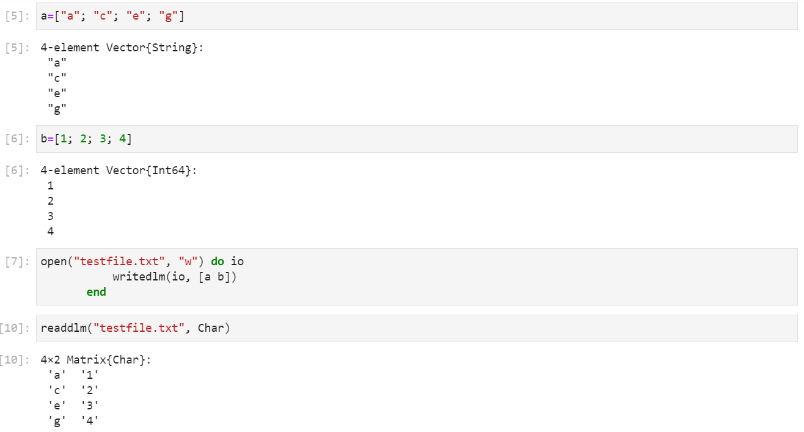

---
## Front matter
lang: "ru"
title: Лабораторная работа № 1
author: Ли Тимофей Александрович, НФИбд-01-18

## Formatting
toc: false
slide_level: 2
theme: metropolis
header-includes: 
 - \metroset{progressbar=frametitle,sectionpage=progressbar,numbering=fraction}
 - '\makeatletter'
 - '\beamer@ignorenonframefalse'
 - '\makeatother'
aspectratio: 43
section-titles: true
---

# Цель работы

Подготовить рабочее пространство и инструментарий для работы с языком программирования Julia, на простейших примерах познакомиться с основами синтаксиса Julia. 

# Ход работы

Выполнил примеры работы с языком Julia:

{ #fig:001 width=90% }

# Ход работы

{ #fig:002 width=90%}

# Ход работы

{ #fig:003 width=90% }

# Ход работы

{ #fig:004 width=90% }

# Ход работы

Изучил документацию к функциям read(), readline(), readlines(), readdlm(), print(), println(), show(), write() и привел примеры их использования:

{ #fig:005 }

# Ход работы

{ #fig:006 }

# Ход работы

{ #fig:007 }

# Ход работы

{ #fig:008 width=90% }

# Ход работы

{ #fig:009 width=90% }

# Ход работы

{ #fig:010 width=90% }

# Ход работы

Изучил документацию к функции parse() и привел пример ее использования:

{ #fig:011 }

# Ход работы

Изучил синтаксис базовых математических операций и проверил их работу с разными типами данных:

{ #fig:012 width=90% }

# Ход работы

{ #fig:013 width=90% }

# Ход работы

Привел примеры базовых операций над матрицами:

{ #fig:014 width=90% }

# Ход работы

{ #fig:015 width=90% }

# Выводы

Подготовил рабочее пространство и инструментарий для работы с языком программирования Julia, на простейших примерах познакомился с основами синтаксиса Julia.