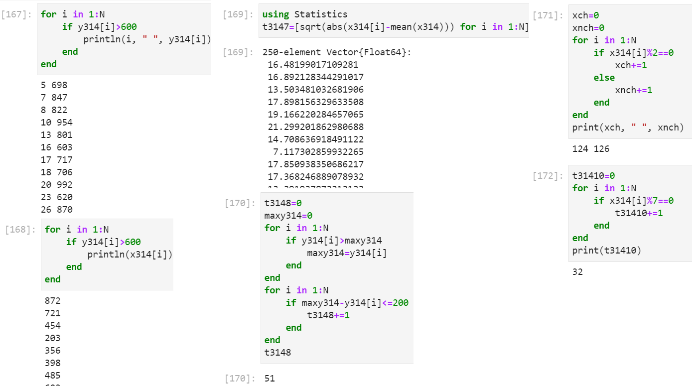

---
## Front matter
lang: "ru"
title: Лабораторная работа № 2
author: Ли Тимофей Александрович, НФИбд-01-18

## Formatting
toc: false
slide_level: 2
theme: metropolis
header-includes: 
 - \metroset{progressbar=frametitle,sectionpage=progressbar,numbering=fraction}
 - '\makeatletter'
 - '\beamer@ignorenonframefalse'
 - '\makeatother'
aspectratio: 43
section-titles: true
---

# Цель работы

Изучить несколько структур данных, реализованных в Julia, научиться применять их и операции над ними для решения задач.

# Ход работы. Кортежи

# Ход работы. Словари

# Ход работы. Словари

# Ход работы. Множества

# Ход работы. Массивы

# Ход работы. Массивы

# Ход работы. Массивы

# Ход работы. Массивы

# Ход работы. №1

# Ход работы. №2

# Ход работы. №3.1-3.3

# Ход работы. №3.4-3.9

# Ход работы. №3.10-3.13

# Ход работы. №3.14

# Ход работы. №3.14

# Ход работы. №3.14

# Ход работы. №4, №5

# Ход работы. №6

# Выводы

Изучил несколько структур данных, реализованных в Julia, научился применять их и операции над ними для решения задач.