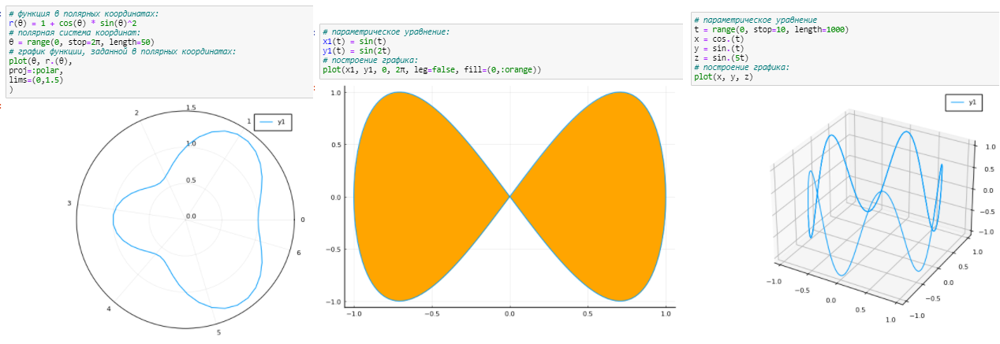
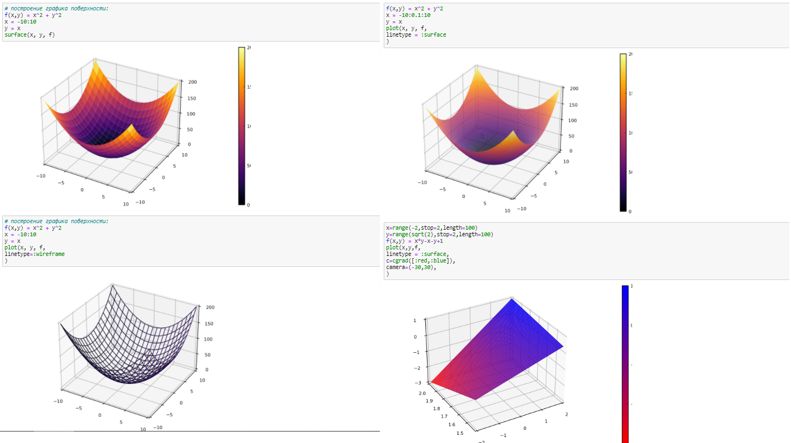
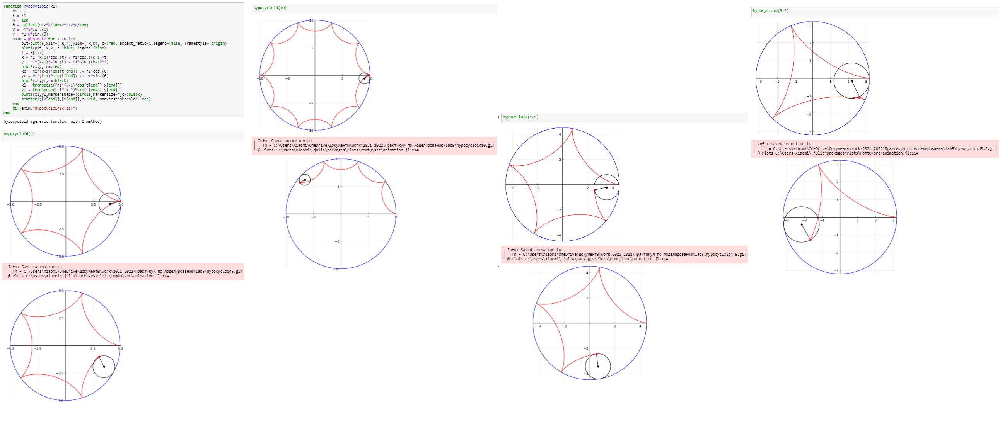

---
## Front matter
lang: "ru"
title: Лабораторная работа № 5
author: Ли Тимофей Александрович, НФИбд-01-18

## Formatting
toc: false
slide_level: 2
theme: metropolis
header-includes: 
 - \metroset{progressbar=frametitle,sectionpage=progressbar,numbering=fraction}
 - '\makeatletter'
 - '\beamer@ignorenonframefalse'
 - '\makeatother'
aspectratio: 43
section-titles: true
---

# Цель работы

Освоить синтаксис языка Julia для построения графиков.

# Ход работы. Примеры

# Ход работы. Примеры

# Ход работы. Примеры

# Ход работы. Примеры

# Ход работы. Примеры

# Ход работы. Примеры

# Ход работы. Примеры

# Ход работы. Примеры

# Ход работы. Примеры

# Ход работы. Примеры

# Ход работы. Примеры

# Ход работы. Примеры

# Ход работы. Примеры

# Ход работы. примеры

# Ход работы. Примеры

# Ход работы. 1-3

# Ход работы. 4-6

# Ход работы. 7-9

# Ход работы. 10

# Ход работы. 4

# Выводы

Освоил синтаксис языка Julia для построения графиков.