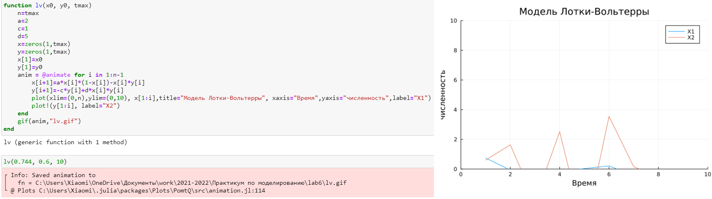
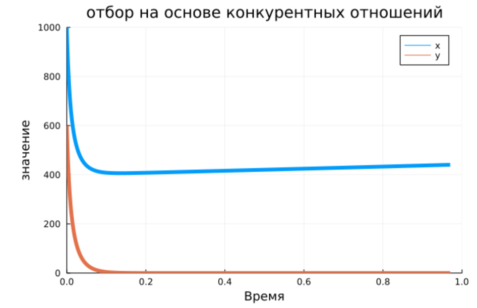

---
## Front matter
lang: "ru"
title: Лабораторная работа № 6
author: Ли Тимофей Александрович, НФИбд-01-18

## Formatting
toc: false
slide_level: 2
theme: metropolis
header-includes: 
 - \metroset{progressbar=frametitle,sectionpage=progressbar,numbering=fraction}
 - '\makeatletter'
 - '\beamer@ignorenonframefalse'
 - '\makeatother'
aspectratio: 43
section-titles: true
---

# Цель работы

Освоить специализированные пакеты для решения задач в непрерывном и дискретном времени.

# Ход работы. Примеры

# Ход работы. Примеры

# Ход работы. Примеры

# Ход работы. Примеры

# Ход работы. Примеры

# Ход работы. Примеры

# Ход работы. Модель Мальтуса

# Ход работы. Логистическая модель

# Ход работы. Модель SIR

# Ход работы. Модель SEIR

# Ход работы. дискретная модель Лотки-Вольтерры

# Ход работы. отбор на основе конкурентных отношений

# Ход работы. отбор на основе конкурентных отношений

# Ход работы. консервативный осциллятор

# Ход работы. консервативный осциллятор

# Ход работы. осциллятор

# Ход работы. осциллятор

# Выводы

Освоил специализированные пакеты для решения задач в непрерывном и дискретном времени.