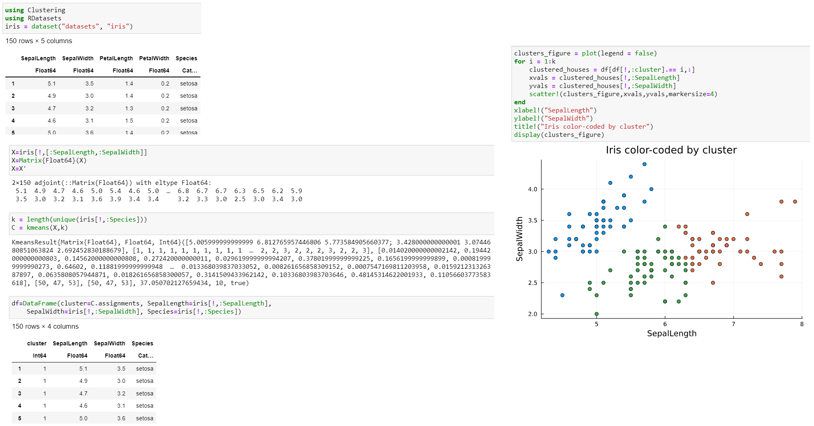

---
## Front matter
lang: "ru"
title: Лабораторная работа № 7
author: Ли Тимофей Александрович, НФИбд-01-18

## Formatting
toc: false
slide_level: 2
theme: metropolis
header-includes: 
 - \metroset{progressbar=frametitle,sectionpage=progressbar,numbering=fraction}
 - '\makeatletter'
 - '\beamer@ignorenonframefalse'
 - '\makeatother'
aspectratio: 43
section-titles: true
---

# Цель работы

Изучить специализированные пакеты Julia для обработки данных.

# Ход работы. Примеры

# Ход работы. Примеры

# Ход работы. Примеры

# Ход работы. Примеры

# Ход работы. Примеры

# Ход работы. Примеры

# Ход работы. Примеры

# Ход работы. Примеры

# Ход работы. Примеры

# Ход работы. Примеры

# Ход работы. Примеры

# Ход работы. Примеры

# Ход работы. K-Means

# Ход работы. Регрессия (метод наименьших квадратов в случае линейной регрессии)

# Ход работы. Модель ценообразования биномиальных опционов

# Выводы

Изучил специализированные пакеты Julia для обработки данных.
