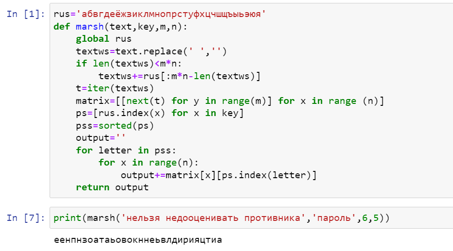
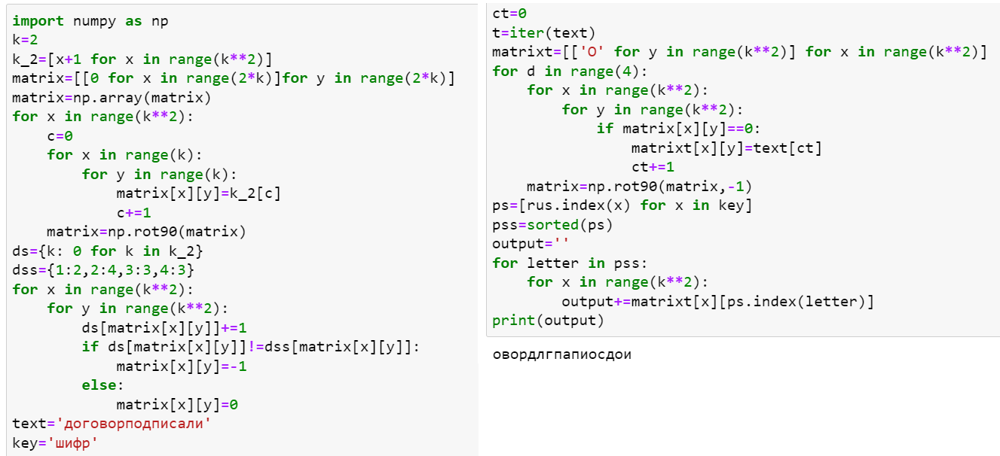
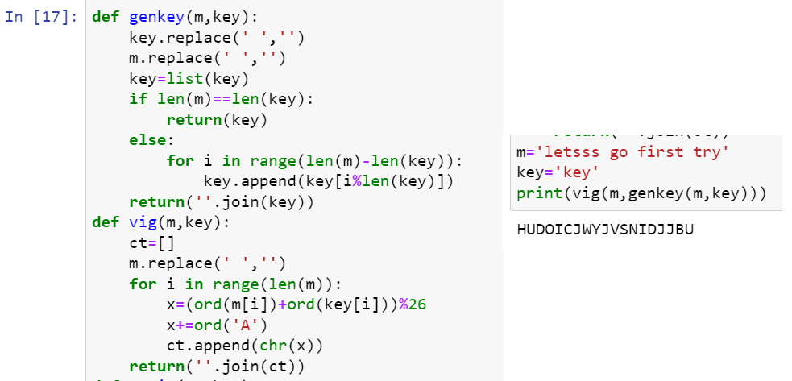

---
## Front matter
title: "Лабораторная работа №2"
subtitle: "Шифры перестановки"
author: "Ли Тимофей Александрович, НФИмд-02-22"

## Generic otions
lang: ru-RU
toc-title: "Содержание"

## Pdf output format
toc: true # Table of contents
toc-depth: 2
lof: true # List of figures
lot: true # List of tables
fontsize: 12pt
linestretch: 1.5
papersize: a4
documentclass: scrreprt
## I18n polyglossia
polyglossia-lang:
  name: russian
  options:
	- spelling=modern
	- babelshorthands=true
polyglossia-otherlangs:
  name: english
## I18n babel
babel-lang: russian
babel-otherlangs: english
## Fonts
mainfont: PT Serif
romanfont: PT Serif
sansfont: PT Sans
monofont: PT Mono
mainfontoptions: Ligatures=TeX
romanfontoptions: Ligatures=TeX
sansfontoptions: Ligatures=TeX,Scale=MatchLowercase
monofontoptions: Scale=MatchLowercase,Scale=0.9
## Biblatex
biblatex: true
biblio-style: "gost-numeric"
biblatexoptions:
  - parentracker=true
  - backend=biber
  - hyperref=auto
  - language=auto
  - autolang=other*
  - citestyle=gost-numeric
## Pandoc-crossref LaTeX customization
figureTitle: "Рис."
tableTitle: "Таблица"
listingTitle: "Листинг"
lofTitle: "Список иллюстраций"
lotTitle: "Список таблиц"
lolTitle: "Листинги"
## Misc options
indent: true
header-includes:
  - \usepackage{indentfirst}
  - \usepackage{float} # keep figures where there are in the text
  - \floatplacement{figure}{H} # keep figures where there are in the text
---

# Цель работы

Цель данной работы --- изучить и программно реализовать шифры перестановки.

# Задание

Заданием является:

- Реализовать маршрутное шифрование
- Реализовать шифрование с помощью решеток
- Реализовать таблицу Виженера

# Теоретическое введение

Шифры перестановки преобразуют открытый текст в криптограмму путём перестановки его символов.
Способ, каким при шифровании переставляются буквы открытого текста, и является ключом шифра.
Важным требованием является равенство длин ключа исходного текста.

# Выполнение лабораторной работы

Для реализации шифров мы будем использовать Python, так как его синтаксис позволяет быстро реализовать необходимые нам алгоритмы.

## Реализация маршрутного шифрования

Код маршрутного шифрования реализуем в виде функции следующего вида:

{ #fig:001 }

Для проверки ввели текст как в лабораторной работе, получили тот же результат. 

## Реализация шифрования с помощью решеток

Шифрование с помощью решеток реализуем в виде функции следующего вида:

{ #fig:002 }

Для проверки ввели текст как в лабораторной работе, получили тот же результат.

## Реализация таблицы Виженера

Таблицу Виженера реализуем в виде функций следующего вида:

{ #fig:003 }

# Выводы

Лабораторная работа выполнена.

