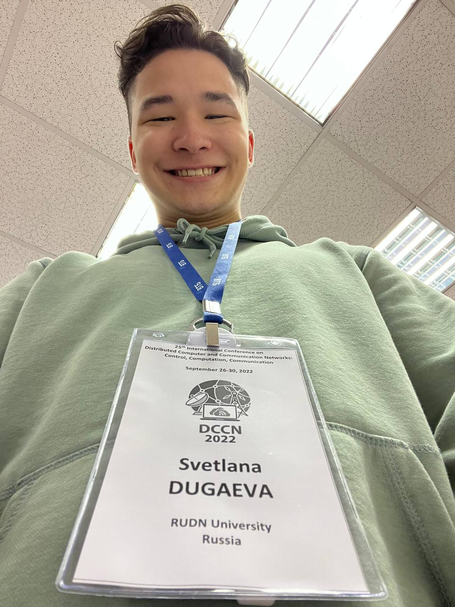
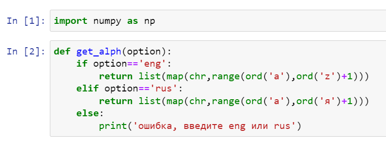
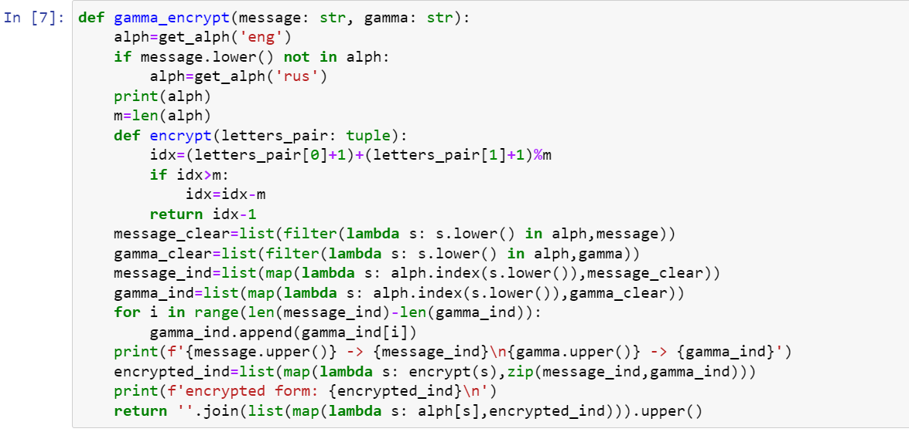
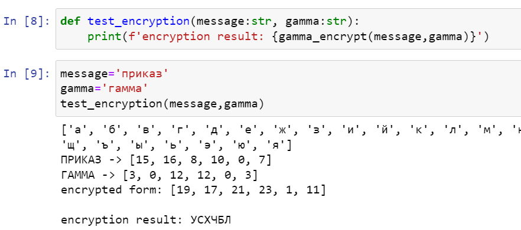
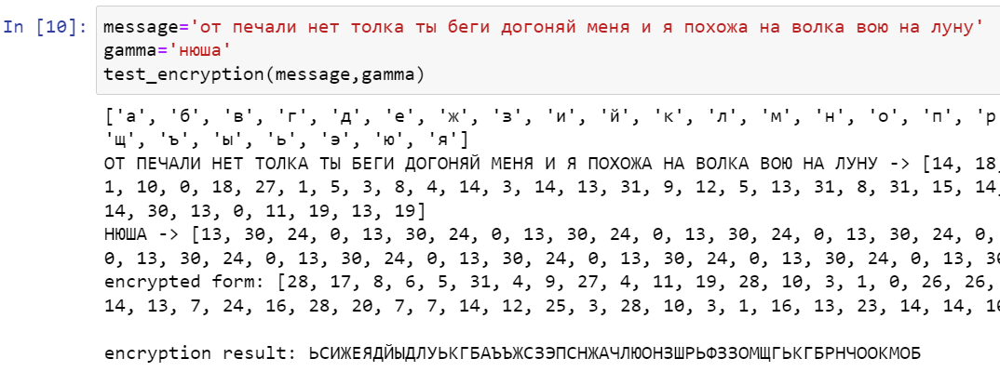

---
## Front matter
lang: ru-RU
title: Лабораторная работа №3
subtitle: Шифрование гаммированием
author:
  - Ли Т.А.
institute:
  - Российский университет дружбы народов, Москва, Россия
date: 14 октября 2022

## i18n babel
babel-lang: russian
babel-otherlangs: english

## Formatting pdf
toc: false
toc-title: Содержание
slide_level: 2
aspectratio: 169
section-titles: true
theme: metropolis
header-includes:
 - \metroset{progressbar=frametitle,sectionpage=progressbar,numbering=fraction}
 - '\makeatletter'
 - '\beamer@ignorenonframefalse'
 - '\makeatother'
---

# Докладчик

:::::::::::::: {.columns align=center}
::: {.column width="70%"}

  * Ли Тимофей Александрович
  * студент группы НФИмд-02-22, студ. билет 1132223452
  * Российский университет дружбы народов
  * [1132223452@rudn.ru](mailto:1132223452@rudn.ru)

:::
::: {.column width="30%"}

:::
::::::::::::::

# Цель работы

Цель данной работы --- изучить и программно реализовать шифрование гаммированием.

# Задание

Заданием является:

- Реализовать шифрование гаммированием конечной гаммой.

# Теоретическое введение

Давайте считать, что я тут написал что-то по теме. Мне просто выходить из дома через полчаса, не успеваю что-то сделать, а в раздатке текст не копируется.

# Выполнение лабораторной работы

Для реализации шифров мы будем использовать Python, так как его синтаксис позволяет быстро реализовать необходимые нам алгоритмы.

# Реализация шифрования гаммированием

Создал функцию создания алфавита:

{ #fig:001 }

# Реализация шифрования гаммированием

Шифрование гаммированием реализовал следующей функцией:

{ #fig:002 width=60%}

# Реализация шифрования гаммированием

Написал функцию тестирования алгоритма, проверил для вводных из текста лабораторной, результат совпал:

{ #fig:003 width=60%}

# Реализация шифрования гаммированием

Также провел шифрование для легендарных строк Нюши:

{ #fig:004 width=60%}

# Выводы

Лабораторная работа выполнена.